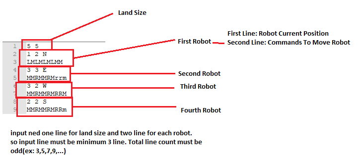

# Mars-Rover

Project is a console application. It reads inputs from "input.txt" in project. If you try the project please do not delete "input.txt".
You can edit your inputs. 

Description of input 

